###  Overview

This Project consists of a voice command assistant that will allow you to make online purchases in an online store site based on Shopify.

The Alexa-based device should be a channel for requests to add products to the shopping cart.

#### Uses cases

##### Requirements 
- Add product to shopping cart 
- Check product price
- Check product availability
- Simulate online purchase checkout

### Goals

- Define the technology stack 
- Define the solution overview 
- Document the reason of the technology selection 

#### Domain 

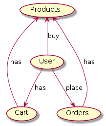

#### Components

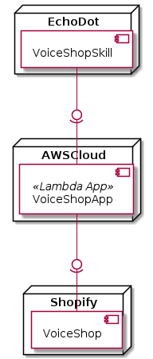

#### Flow/Voice UI 

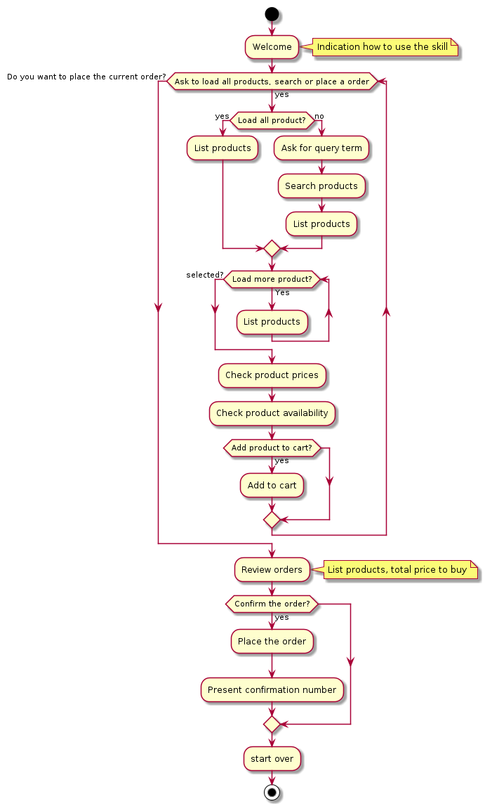

### Technology Stack

Here is technology stack benchmark and selection.

<table>
  <thead>
    <tr>
      <th>Decision</th>
      <th>Alts</th>
      <th>Pros</th>
      <th>Cons</th>
    </tr>
  </thead>
  <tbody>
    <tr>
      <td>Programming language: node</td>
      <td>
        <ul>
          <li>Java</li>
          <li>C#</li>
          <li>JavaScript</li>
			<li>Python</li>
        </ul>
      </td>
      <td>
        <ul>
          <li>Developer knowledge</li>
          <li>Native support</li>
          <li>Simplicity</li>
          <li>Modern code approach</li>          
        </ul>
      </td>
      <td>
        <ul>
          <li>n/a</li>
        </ul>
      </td>
    </tr>
    <tr>
      <td>REST Admin Shopify API</td>
      <td>
        <ul>
          <li>GraphQL API</li>
          <li>Storefront API</li>
        </ul>
      </td>
      <td>
        <ul>
          <li>Simplicity</li>
          <li>Big community</li>
        </ul>
      </td>
      <td>
        <ul>
          <li>It has some use quote but for this POC the number of user will be low</li>
        </ul>
      </td>
    </tr> 
    <tr>
      <td>AWS ASK CLI</td>
      <td>
        <ul>
          <li>Serverless</li>
			<li>SAM</li>
        </ul>
      </td>
      <td>
        <ul>
          <li>AWS Community</li>
          <li>CloudFormation compatible</li>
          <li>Official AWS Support</li>
          <li>Has VS Code integration, so we can use code first approach to create our skill</li>          
        </ul>
      </td>
      <td>
        <ul>
          <li>Is only possible to use for Alexa skill, not is a standard tool</li>
        </ul>
      </td>
    </tr>
  </tbody>
</table>

## Deliverable 2

### Goals

- Create a basic skill 
- Documented the skill creation

### Overview

For the skill creation we're using the Alexa ASK CLI, this tool allows us to create the skill using code first approach, this mean that we don't need to get out of our editor/IDE to build the skill. 

For test purpose, we only code a simple skill that make Alexa say "hello world".

### Pre-conditions

Before start the creation of this skill, you must have the tools installed and tasks completed following.

#### Tasks

- AWS Account
- Amazon Developer Account 

#### Tools 

- VS Code 
- Alexa Skills Kit (ASK) Toolkit
- ASK CLI AWS 

### Skill Creation Documentations

#### 1 - Open Alexa Skill Kit

Here we open ours skill kit tool that allow us to create, setup, deploy and development.

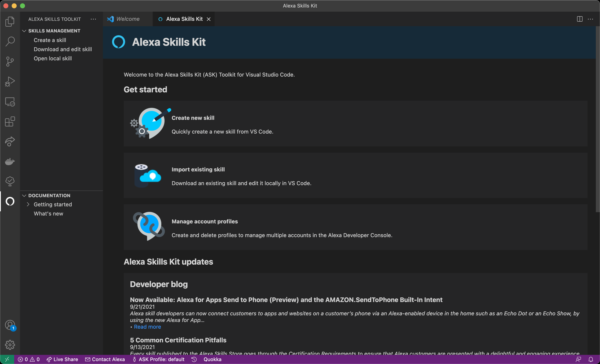

#### 2 - Skill Creation Setup

Here we set up the skill: technology, template and folder.

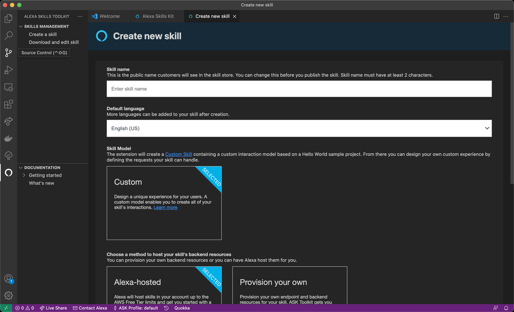

#### 3 - Creating Skill

Here we're waiting to ours CLI create all resources in AWS.


#### 4 - Change Invocation World

Firs for creating ours skill, we need to change ours invocation world.


#### 5 - Deploy Setup

Here we check ours skill before the deployment.

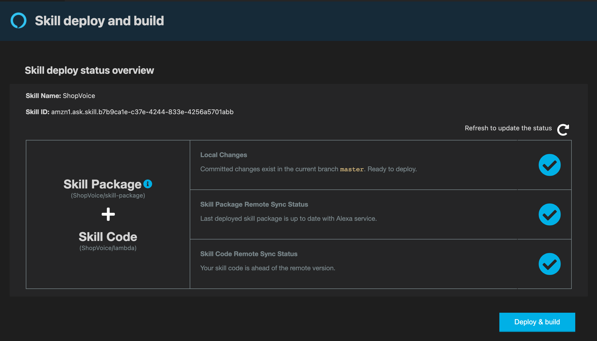

#### 6 - Deploying

Here we're waiting to ours CLI update all resources in AWS and ours skill code.


#### 7 - Testing Invocation World

Using the skill kit to test ours invocation world to open ours skill.

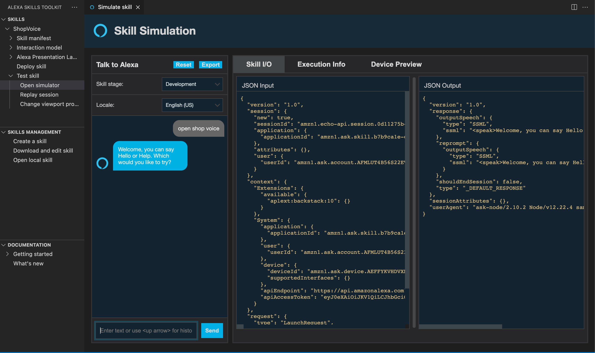

#### 8 - Testing Hello World Intent 

Then we test ours skill, basic intent.

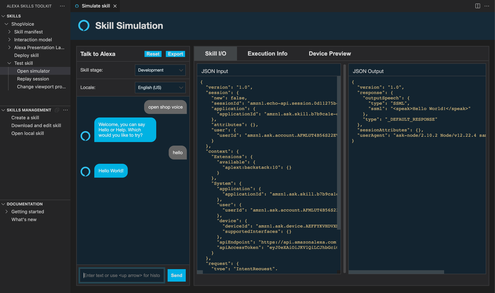

## Deliverable 3

### Goals

- Integrate Alexa with Shopify API
- Documented Shopify integration

### Overview

For this integration, we use Shopify Admin API and a rest client to request all the needed endpoint.

### Pre-conditions

Before to start the integration, you must have set up a Shopify dev account.

#### Tasks

- AWS Account
- Amazon Developer Account 
- Shopify Dev Account 

#### Tools 

- VS Code 
- Alexa Skills Kit (ASK) Toolkit
- ASK CLI AWS 
- Shopify Account 

### Skill Creation Documentations

#### 1 - Create dev store 

Go to https://shopify.dev/ and sign in with your developer account and create a new store, this going to allow you to work with Shopify without any cost.


#### 2 - Setup admin API

Go to you store and sign in with you dev account and go home/apps and create a private app, this going to enable the Admin API.

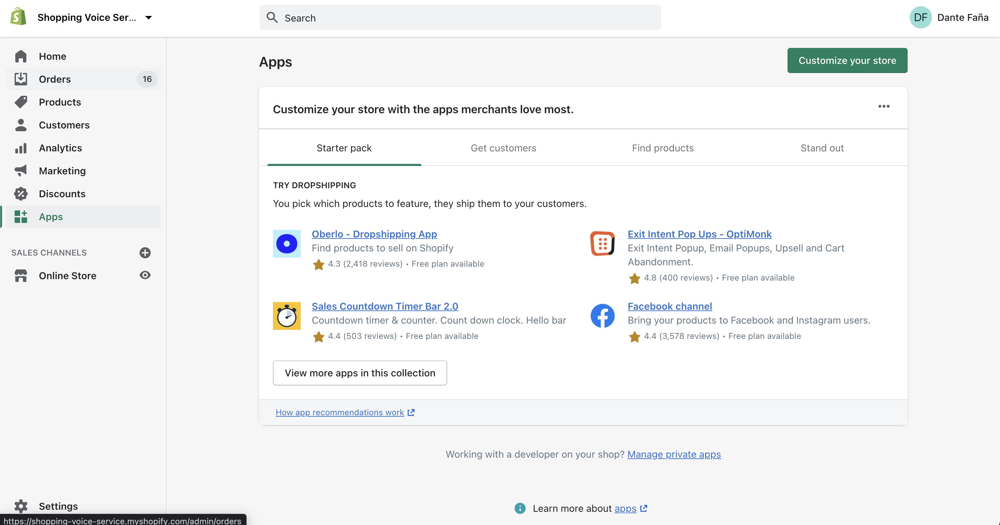
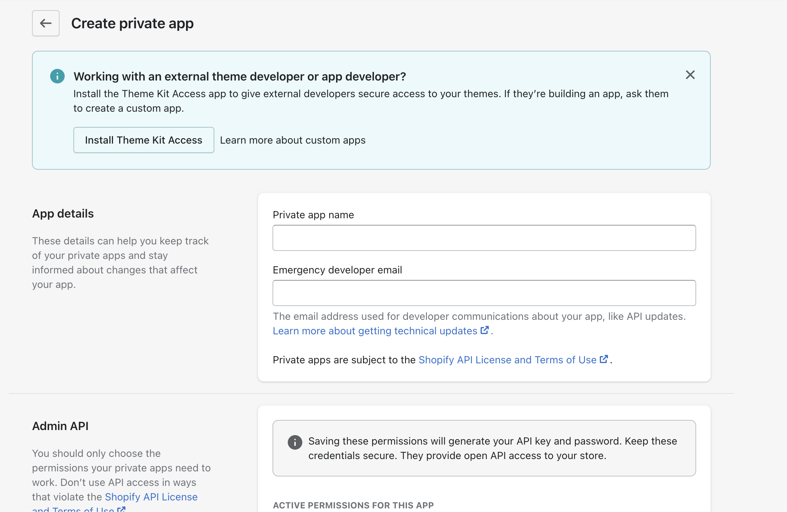


#### 3 - Test endpoints

Now copy you API Key and your secret key and let's test the API with CURL.

##### All Products

```bash
curl 
  --location 
  --request GET 'https://{store-name}.myshopify.com/admin/api/2021-07/products.json?limit=5&fields=id,images, title,variants,tags&since_id='
  --header 'Authorization: Basic base64(username:password)'
```

##### Create an Order

```bash
curl 
    --location 
    --request POST 'https://{store-name}.myshopify.com/admin/api/2021-07/orders.json' 
    --header 'Authorization: Basic base64(username:password)'
    --header 'Content-Type: application/json' \
    --data-raw '{
    "order": {
        "line_items": [
            {
                "variant_id": ${id_product},
                "quantity": 1
            }
        ],
        "customer": {
            "email": "${email}"
        }
    }
}'
```

#### 4 - Integrate with Alexa Skill

With all the integrations setup and the API testing process to create the Alexa Integrations.

##### Services encapsulation logic with Axios and Rest API

```js
class ShopifyServices{
    
    #client;

    constructor(config = shopifyConfig){
        const token = Buffer.from(`${config.username}:${config.password}`).toString('base64');
        this.#client = axios.create({
            baseURL: config.baseUrl,
            headers: {
                'Authorization': `Basic ${token}`,
                'Content-Type': 'application/json'
            }
          });
    }

    async getRecommendedProduct({ sinceId = '', limit = 1, fields = 'id,images,title,variants,tags'}){
        try {
            return (await this.#client.get(`/products.json?limit=${limit}&fields=${fields}&since_id=${sinceId}`)).data.products[0];
        } catch(e) {
            throw e;
        }
    }

    async placerOrder(order){
        try {
            const data = JSON.stringify({
                order: {
                    line_items: order.items.map((el) => {
                        return {
                            variant_id: el.variantId,
                            quantity: el.quantity
                        }
                    }),
                    customer: {
                        email: order.email
                    }
                }
            });
            return (await this.#client.post('/orders.json', data)).data.order;
        } catch(e) {
            throw e;
        }
    }
}
```

##### Alexa Call with Shopify Services

We can use the services that we create to call without problem to Shopify API (line 9).

```js
const ShowProductsIntentHandler = {
    canHandle(handlerInput) {
        return Alexa.getRequestType(handlerInput.requestEnvelope) === 'IntentRequest'
            && Alexa.getIntentName(handlerInput.requestEnvelope) === 'ShowProductsIntent';
    },

    async handle(handlerInput) {
        const {attributesManager} = handlerInput;
        const attributes = handlerInput.attributesManager.getPersistentAttributes()
        const currentProduct = attributes.currentProduct || undefined;

        const product = await Shopify.getRecommendedProduct({ sinceId: currentProduct ? currentProduct.id : undefined });
        const speakOutput = `This is our recommended product:  ${product.title}`;

        attributes.currentProduct = product;

        handlerInput.attributesManager.setPersistentAttributes(attributes);
        handlerInput.attributesManager.savePersistentAttributes();

        return handlerInput.responseBuilder
            .speak(speakOutput)
            .addDelegateDirective({
                name: 'AddProductIntent',
                confirmationStatus: 'NONE',
                slots: {}
            })
            .getResponse();
    }
}
```


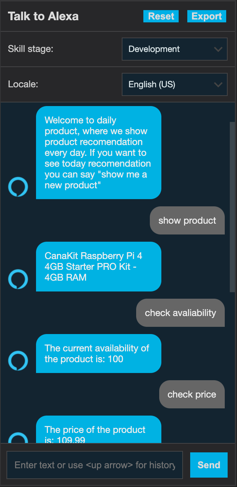
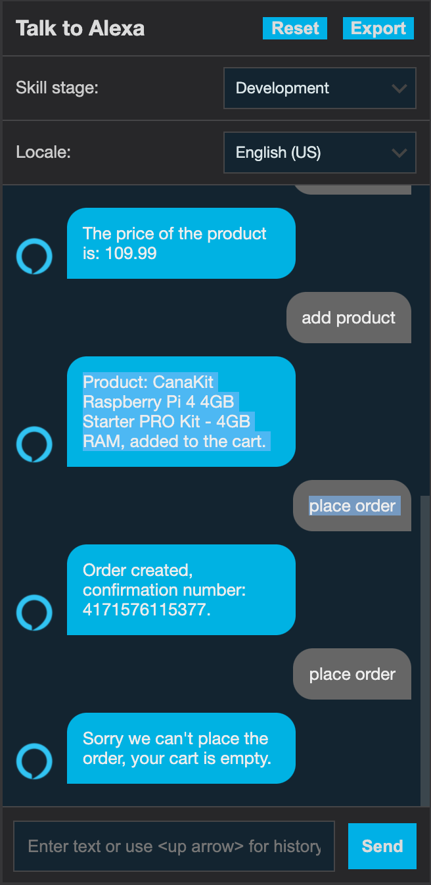

🔍 NLP Intent Classification (Hugging Face)
To enhance the Alexa Skill with flexible understanding of user queries, I integrated an NLP classifier using the zero-shot-classification pipeline from Hugging Face 🤖.

🔧 What Was Used
Model: facebook/bart-large-mnli

Library: transformers from Hugging Face

Pipeline Type: Zero-Shot Classification

Integration: Inside Flask endpoint handling Alexa POST requests

🧠 Why I Used It
Traditional intent detection is rigid (relies on static utterances).

Hugging Face’s zero-shot model allows classification of dynamic queries without retraining a model.

This makes the skill more intelligent, understanding new phrases and classifying them based on a few predefined labels like "get_product", "track_order", etc.


## 📄 License

This project is licensed under the MIT License.

MIT License

Copyright (c) 2025 Saloni Angre

Permission is hereby granted, free of charge, to any person obtaining a copy
of this software and associated documentation files (the "Software"), to deal
in the Software without restriction, including without limitation the rights
to use, copy, modify, merge, publish, distribute, sublicense, and/or sell
copies of the Software, and to permit persons to whom the Software is
furnished to do so, subject to the following conditions:

The above copyright notice and this permission notice shall be included in all
copies or substantial portions of the Software.

THE SOFTWARE IS PROVIDED "AS IS", WITHOUT WARRANTY OF ANY KIND, EXPRESS OR
IMPLIED, INCLUDING BUT NOT LIMITED TO THE WARRANTIES OF MERCHANTABILITY,
FITNESS FOR A PARTICULAR PURPOSE AND NONINFRINGEMENT. IN NO EVENT SHALL THE
AUTHORS OR COPYRIGHT HOLDERS BE LIABLE FOR ANY CLAIM, DAMAGES OR OTHER
LIABILITY, WHETHER IN AN ACTION OF CONTRACT, TORT OR OTHERWISE, ARISING FROM,
OUT OF OR IN CONNECTION WITH THE SOFTWARE OR THE USE OR OTHER DEALINGS IN THE
SOFTWARE.
